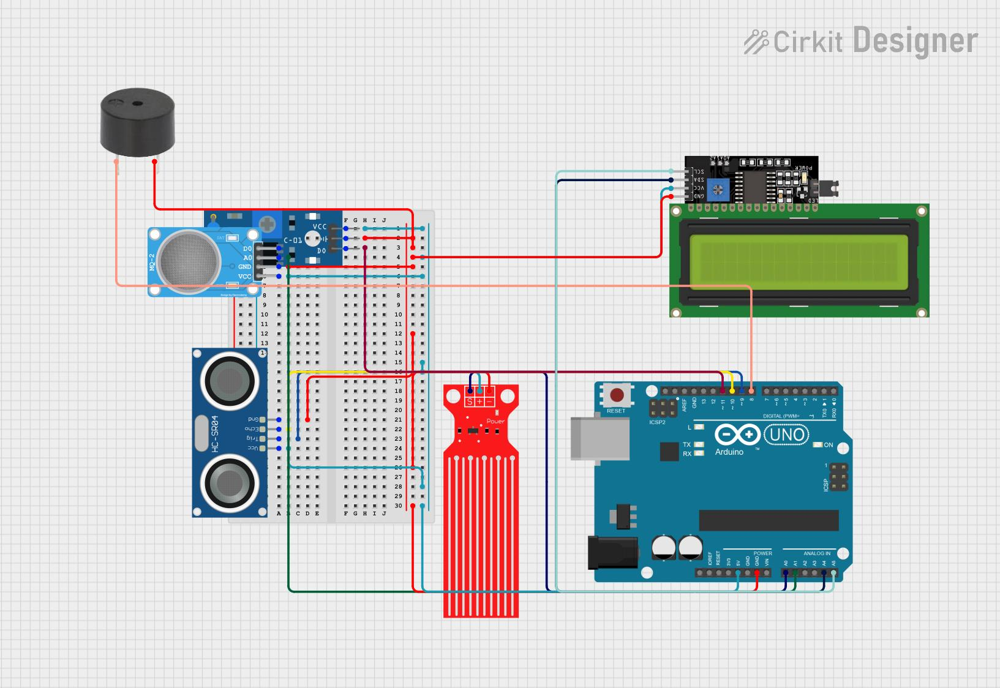

# 🌫️ Compact Air Quality Monitoring Hub

> An Arduino-based environmental monitoring system that detects toxic gases, dust accumulation, and industrial vibrations — simulating air pollution conditions found in smog-heavy and industrial environments.

---

## 📋 Table of Contents

- [Features](#features)
- [Components](#components)
- [Circuit Connections](#circuit-connections)
- [How It Works](#how-it-works)
- [Pollution Classification Logic](#pollution-classification-logic)
- [Testing the Sensors](#testing-the-sensors)
- [LCD Troubleshooting](#lcd-troubleshooting)
- [Upload Procedure](#upload-procedure)
- [Project Files](#project-files)
- [Future Improvements](#future-improvements)

---

## ✨ Features

- **MQ Gas Sensor** — detects smoke, alcohol vapors, LPG, and other toxic gases
- **Soil Moisture Probe** — repurposed as a particulate / dust deposition sensor
- **Vibration Sensor** — picks up industrial activity and heavy machinery
- **16×2 I2C LCD** — live real-time monitoring display
- **Pollution Classification** — automatic air quality status output
- **USB Powered** — runs directly from a laptop, no external supply needed
- **No 10kΩ resistor needed** — uses Arduino's internal pull-up on A0

---

## 🧰 Components

| Component | Purpose |
|---|---|
| Arduino UNO | Main microcontroller |
| MQ Gas Sensor | Toxic gas detection |
| Soil Moisture Probe (2-pin) | Dust / particulate accumulation |
| Vibration Sensor | Industrial activity detection |
| 16×2 I2C LCD | Live data display |
| Breadboard | Power distribution |
| Jumper Wires | Connections |

---

## 🔌 Circuit Connections

### Power

```
Laptop USB  →  Arduino USB Port
Arduino 5V  →  Breadboard +
Arduino GND →  Breadboard −
```

---

### Soil Moisture Probe (2-pin)

```
Probe Pin 1  →  Arduino A0
Probe Pin 2  →  Arduino GND
```

> Uses Arduino's internal pull-up resistor — no external resistor needed:
> ```cpp
> pinMode(A0, INPUT_PULLUP);
> ```

---

### MQ Gas Sensor

```
MQ VCC  →  Breadboard +
MQ GND  →  Breadboard −
MQ AO   →  Arduino A1
MQ DO   →  Arduino D3
```

---

### Vibration Sensor

```
Vibration VCC  →  Breadboard +
Vibration GND  →  Breadboard −
Vibration DO   →  Arduino D2
```

---

### 16×2 I2C LCD

```
LCD VCC  →  Breadboard +
LCD GND  →  Breadboard −
LCD SDA  →  Arduino A4
LCD SCL  →  Arduino A5
```

---

## 🗺️ Circuit Diagram



> Full wiring reference for all sensor and LCD connections to the Arduino UNO.

---

## ⚙️ How It Works

### MQ Gas Sensor
Detects toxic gases including smoke, perfume vapors, alcohol, and LPG traces. The **AO pin** provides an analog pollution reading that is compared against a threshold.

### Soil Moisture Probe
Used unconventionally as a **dust deposition sensor**. As dust and moisture accumulate on the probes, the conductivity between them changes — giving a measurable pollution signal.

### Vibration Sensor
Detects machinery vibrations, heavy movement, table impacts, and general industrial activity. Works in combination with the dust sensor to classify air conditions.

---

## 🚦 Pollution Classification Logic

| Condition | LCD Output |
|---|---|
| Gas reading > threshold | `GAS DETECTED` |
| Dust + vibration detected | `INDUSTRIAL AIR` |
| Dust only | `DUSTY AIR` |
| All clear | `AIR CLEAN` |

---

## 🧪 Testing the Sensors

### MQ Gas Sensor

> ⚠️ Allow **2–5 minutes warm-up time** after powering on before testing.

**Method 1 — Perfume Spray**
Spray perfume 30–40 cm from the sensor.
Expected: AO value rises → LCD shows `GAS DETECTED`

**Method 2 — Hand Sanitizer**
Hold sanitizer bottle near the sensor.
Expected: Gas value spikes noticeably

---

### Soil Moisture Probe

**Finger Test**
Touch both probe terminals with your fingers.
Expected: Analog value changes

**Breath Test**
Blow humid air directly onto the probe.
Expected: Conductivity increases

---

### Vibration Sensor

**Table Tap Test**
Tap the table lightly near the sensor.
Expected: Vibration triggers

**Phone Vibration Test**
Place a vibrating phone close to the sensor.
Expected: Vibration is detected

---

## 🖥️ LCD Troubleshooting

| Symptom | Fix |
|---|---|
| Blank screen | Try changing I2C address: `0x27` → `0x3F` |
| Only black boxes visible | Adjust the contrast potentiometer on the back of the LCD |
| No display at all | Verify: SDA→A4, SCL→A5, VCC and GND connected properly |

---

## 📤 Upload Procedure

To avoid upload conflicts with connected sensors:

1. **Disconnect all sensors** from the Arduino
2. Connect only the **Arduino + USB cable**
3. **Upload the code** via Arduino IDE
4. **Reconnect sensors** after upload is complete

---

## 📁 Project Files

| File | Description |
|---|---|
| `sketch_bot.ino` | Main project code |
| `lcd_testercode.ino` | LCD diagnostic/test code |
| `ckt_diagram.jpg` | Full circuit wiring diagram |

### LCD Test
If the LCD isn't displaying correctly, run `lcd_testercode.ino` first. A working LCD should show:
```
LCD IS WORKING
HELLO WORLD
```

---

## 🚀 Future Improvements

- [ ] Add PM2.5 sensor for fine particulate measurement
- [ ] Upgrade to ESP32 for WiFi connectivity
- [ ] Cloud data logging and dashboards
- [ ] Mobile app integration
- [ ] Buzzer alerts for threshold breaches
- [ ] Battery backup for portable use

---

## 👤 Author

Built as a compact environmental sensing prototype using Arduino UNO.
